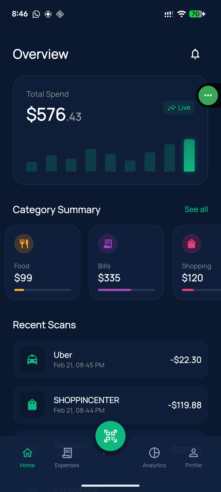
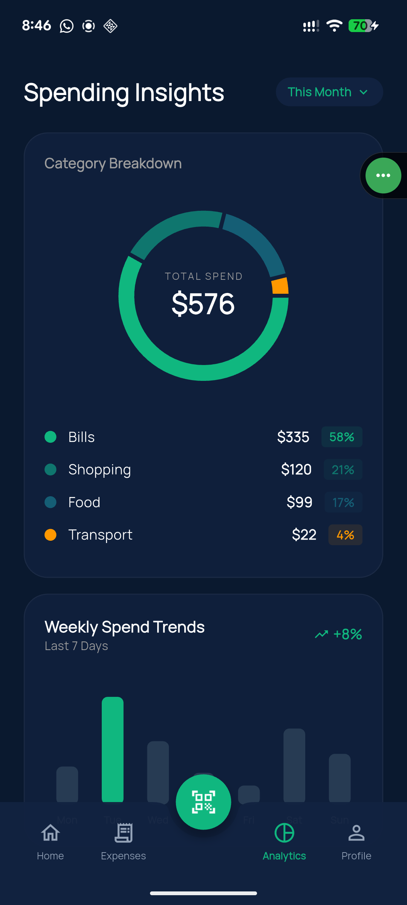
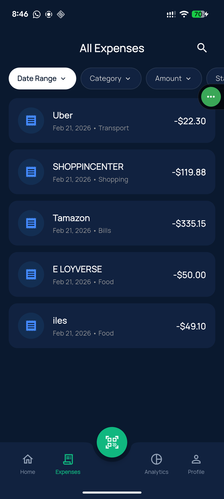

# 💸 Expensify - AI-Powered Expense Tracker

An elegant, offline-first personal finance app built with Flutter. Expensify leverages on-device Machine Learning to automatically scan and extract data from physical or digital receipts, turning expense tracking from a chore into a seamless experience.

## ✨ Key Features

* **🧠 Smart Receipt Scanner:** Uses Google ML Kit (Optical Character Recognition) to instantly read physical receipts or images from your gallery, automatically extracting the Merchant Name and Total Amount.
* **📊 Real-time Analytics:** Beautiful, interactive charts (Donut and Bar charts) that instantly recalculate your category breakdown and weekly spend trends.
* **⚡ Offline-First Architecture:** Powered by a blazing-fast local Hive database. Your financial data never leaves your device and is accessible without an internet connection.
* **🎨 Premium Glassmorphism UI:** A sleek, deep-navy dark mode design featuring translucent glass overlays, custom bottom navigation, and fluid animations.
* **👆 Swipe-to-Delete:** Intuitive gesture controls to effortlessly manage your transaction history.

## 📱 Screenshots

| Dashboard | AI Receipt Scanner | Analytics | History |
| :---: | :---: | :---: | :---: |
|  |  |  |  |

## 🛠 Tech Stack & Architecture

* **Framework:** Flutter & Dart
* **State Management:** Riverpod (`flutter_riverpod`)
* **Local Database:** Hive (`hive_flutter`, NoSQL)
* **Machine Learning:** Google ML Kit Vision (`google_ml_kit` for on-device Text Recognition)
* **Data Visualization:** FL Chart (`fl_chart`)
* **Hardware Integration:** `camera` and `image_picker`

## 🚀 Getting Started

### Prerequisites
* Flutter SDK (3.10+)
* Dart SDK (3.0+)
* **Android:** API Level 26 or higher (required for Google ML Kit).
* **iOS:** iOS 12.0 or higher.

### Installation

1. Clone the repository:
   ```bash
   git clone [https://github.com/yourusername/expensify.git](https://github.com/yourusername/expensify.git)

```

2. Navigate to the project directory:
```bash
cd expensify

```


3. Install dependencies:
```bash
flutter pub get

```


### Hardware Permissions

To run this app on a physical device, ensure the camera permissions are set correctly:

**Android (`android/app/src/main/AndroidManifest.xml`):**

```xml
<uses-permission android:name="android.permission.CAMERA" />
<uses-feature android:name="android.hardware.camera" android:required="false" />

```

**iOS (`ios/Runner/Info.plist`):**

```xml
<key>NSCameraUsageDescription</key>
<string>Expensify needs camera access to scan your receipts and extract expense data.</string>

```

4. Run the app:
```bash
flutter run

```


## 🧠 How the AI Scanner Works

Expensify bypasses the need for expensive cloud APIs by running the OCR model directly on the user's device.

1. The user snaps a photo using the `camera` package or selects a screenshot via `image_picker`.
2. The image is fed to `google_ml_kit`'s TextRecognizer.
3. A custom-built RegEx algorithm scans the extracted text blocks to isolate currency formats (e.g., `$45.99`, `12.50`) and intelligently selects the highest reasonable value as the "Total".
4. The parsed data is instantly piped into a Riverpod-managed form for user verification before being committed to the Hive database.


```
